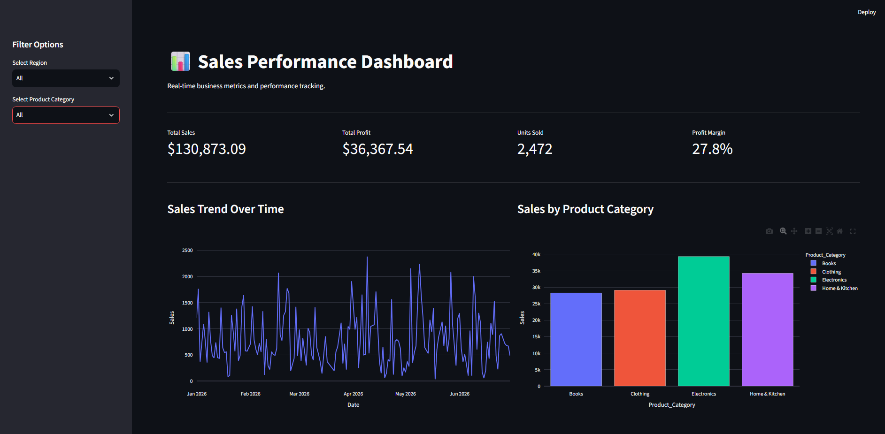
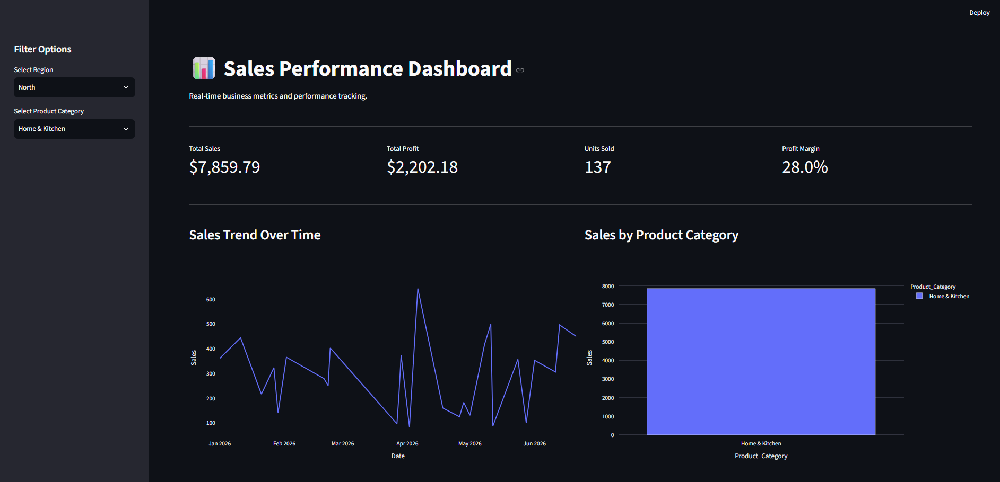

# 📊 Sales Performance Dashboard

A responsive, interactive sales analytics dashboard built with Streamlit and Plotly. Visualises six months of mock sales data across four product categories and four regions, with real-time KPI metrics, dynamic charts, and sidebar filters that update everything instantly on selection.

## 🚀 Live Demo

👉 [View Live Demo](https://your-live-demo-link-here.com)

## ✨ Features

- **Live KPI Metrics Row**: Displays four key business indicators — Total Sales, Total Profit, Units Sold, and Profit Margin — recalculated instantly whenever a filter is applied.
- **Sidebar Filters**: A region selector and a product category selector let users drill into any slice of the data, with an "All" option to reset each filter independently.
- **Sales Trend Line Chart**: A Plotly line chart showing daily aggregated sales over time, making seasonal patterns and spikes immediately visible.
- **Sales by Category Bar Chart**: A colour-coded Plotly bar chart comparing total sales performance across all four product categories side by side.
- **Filterable Data Table**: A full transaction-level table rendered with `st.dataframe` that reflects the active filters, with index hidden for a cleaner look.
- **Cached Data Loading**: `@st.cache_data` ensures the mock dataset is generated once and reused across reruns, keeping the dashboard fast and responsive.
- **Reproducible Mock Data**: `np.random.seed(42)` guarantees the generated dataset is identical on every run, making results consistent and debuggable.
- **Profit Margin Guard**: A zero-division guard on the margin calculation prevents crashes when filters return an empty dataset.

## 🛠️ Tech Stack

- **Python 3**: Core language powering all data generation, filtering, and dashboard logic.
- **Streamlit**: Handles the entire web UI — layout, sidebar, metrics, charts, and table — with no HTML, CSS, or JavaScript required.
  - `st.set_page_config` for page title, icon, and wide layout.
  - `st.columns` for the KPI row and the two-chart row.
  - `st.metric` for the formatted KPI cards.
  - `st.sidebar` for the filter controls.
  - `st.dataframe` for the filterable transaction table.
  - `@st.cache_data` for performance-optimised data loading.
- **Pandas**: Generates the mock DataFrame, handles filtering logic, and aggregates data for each chart via `groupby`.
- **NumPy**: Powers the random data generation — `np.random.choice`, `np.random.uniform`, and `np.random.randint` — with `np.random.seed(42)` for reproducibility.
- **Plotly Express**: Renders the interactive line chart and bar chart, both using the `plotly_white` template for a clean, presentation-ready aesthetic.

## 📖 How to Use

1. **Install Dependencies**: Run `pip install streamlit pandas numpy plotly` in your terminal.
2. **Launch the Dashboard**: Run `streamlit run app.py` — the dashboard opens automatically in your browser.
3. **Apply Filters**: Use the sidebar to select a region and/or product category. All KPIs, charts, and the data table update instantly.
4. **Explore the Charts**: Hover over the line chart and bar chart for interactive tooltips showing exact values.
5. **Inspect the Data**: Scroll through the filtered transaction table at the bottom for row-level detail.

## 📸 Screenshots

| Full Dashboard                        | Filtered View                            |
| ------------------------------------- | ---------------------------------------- |
|  |  |

## 🔮 Future Improvements

- **Date Range Picker**: Add a date slider or date input to let users filter by a custom time window within the six-month dataset.
- **Real Data Source**: Replace the mock data generator with a CSV upload widget or a live database connection.
- **Month-over-Month Delta**: Add delta values to the KPI metric cards showing percentage change from the previous period.
- **Regional Map Chart**: Introduce a choropleth or bubble map to visualise sales performance geographically by region.
- **Export Button**: Allow users to download the filtered dataset as a CSV directly from the dashboard.

## 👤 About

This project was built as an introduction to data dashboarding in Python — exploring how Streamlit, Pandas, and Plotly work together to turn raw data into an interactive, filter-driven analytics UI. It demonstrates data aggregation, real-time UI reactivity, and chart rendering without writing a single line of HTML or JavaScript.
